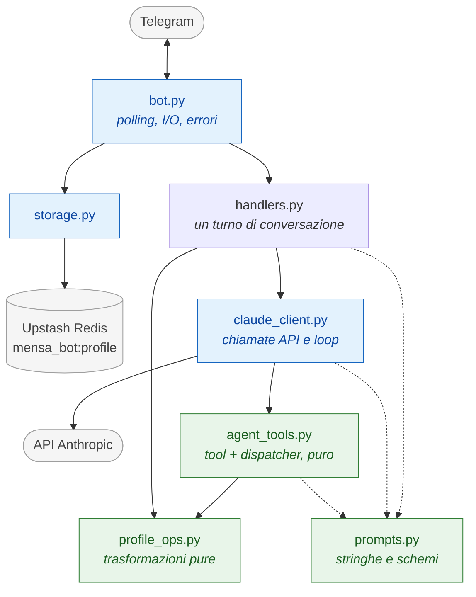
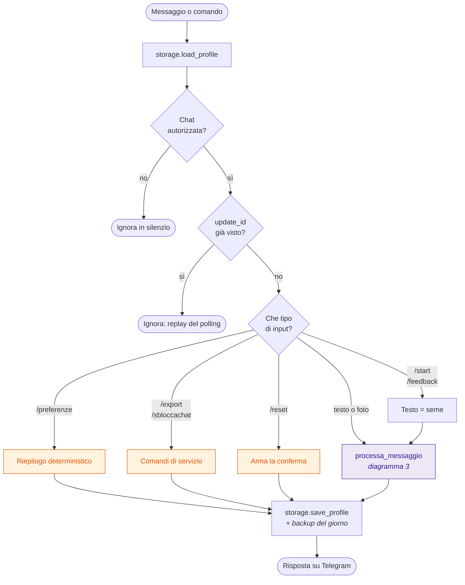
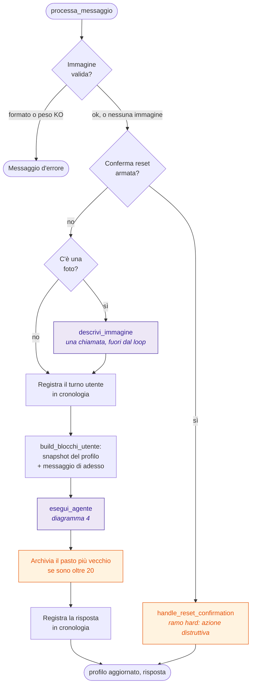
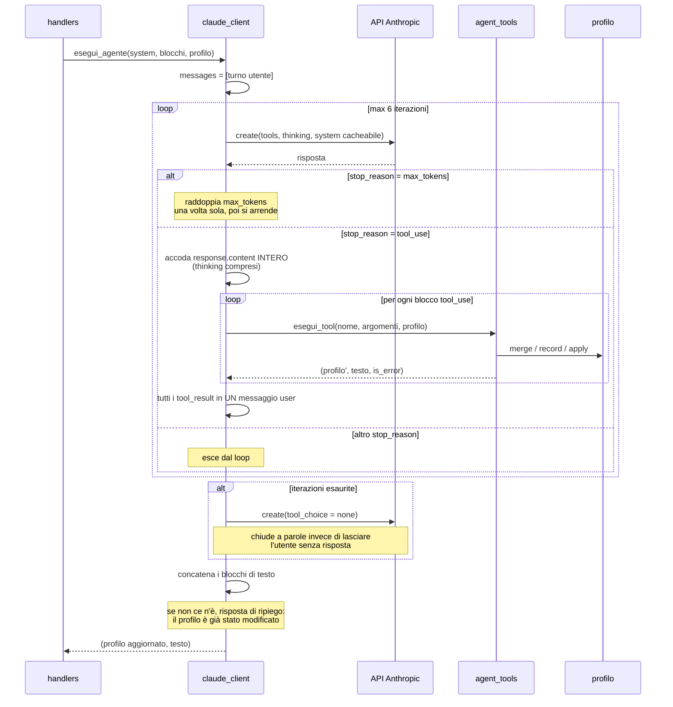
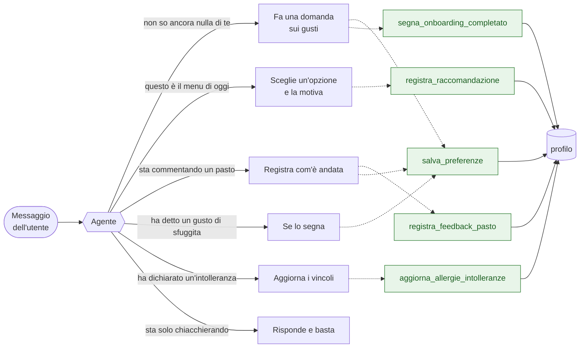
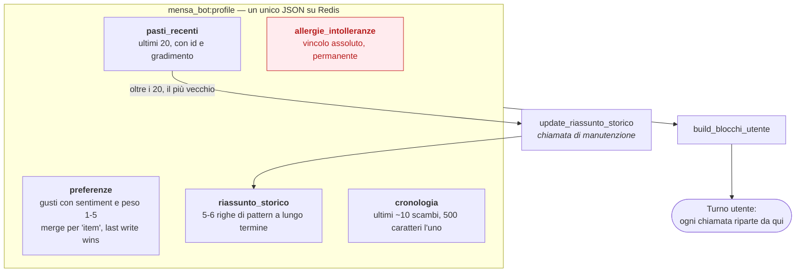
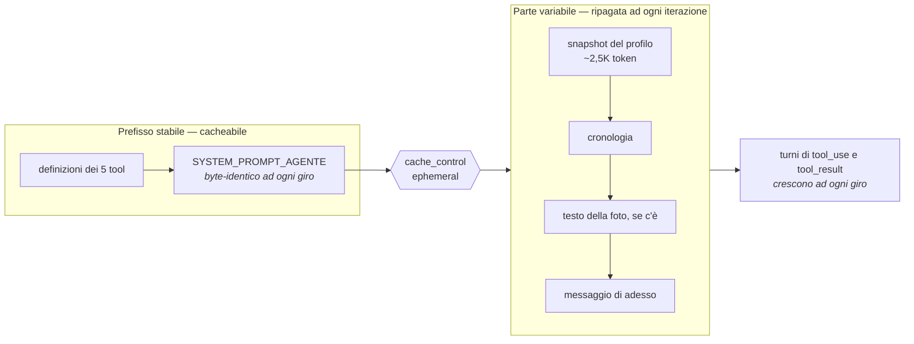

# Architettura

Diagrammi del funzionamento di mensa-bot. Per le regole di sviluppo vedi
`CLAUDE.md`.

## 1. Moduli e dipendenze

Package piatto, dipendenze a senso unico. Ogni modulo conosce una cosa sola:
`bot` conosce Telegram, `claude_client` conosce l'SDK Anthropic, `storage`
conosce Redis. `agent_tools` e `profile_ops` sono puri.

Verde = puro e testabile senza mock. Blu = fa I/O. Grigio = esterno.

## 2. Instradamento in `bot.py`

Due filtri validi per tutto, poi lo smistamento. `/start` e `/feedback` non sono
percorsi separati: sostituiscono il testo con un seme e finiscono nello stesso
`processa_messaggio` di un messaggio scritto a mano.

Arancione = deterministico di proposito. Viola = passa dal modello.

`/preferenze` è arancione perché è una lettura di dati locali: farla passare dal
modello costerebbe una chiamata e permetterebbe un riepilogo inventato.

## 3. Un turno di conversazione

Il corpo di `handlers.processa_messaggio`. Tutto ciò che sta prima dell'agente
sono guardie: nessuna di esse interpreta il contenuto del messaggio.

L'archiviazione è arancione e sta **fuori** dai tool di proposito: è
manutenzione interna, e un suo fallimento non deve diventare un errore su cui
l'agente si mette a ragionare. Se fallisce, la risposta all'utente parte lo
stesso.

## 4. Il loop agentico

Il cuore del sistema. Il modello riceve lo stato e decide se scrivere qualcosa
nel profilo prima di rispondere.

Due dettagli che sembrano marginali e non lo sono:

- `response.content` torna indietro **intero**. Con il thinking attivo i blocchi
  di ragionamento devono accompagnare i `tool_use`, altrimenti l'API rifiuta il
  turno successivo con un 400.
- tutti i `tool_result` vanno in **un solo** messaggio user. Spezzarli insegna
  al modello a smettere di chiamare i tool in parallelo.

## 5. Cosa può decidere il modello

Non c'è routing per intento: il modello riceve lo stesso contesto in ogni caso e
sceglie. La colonna dei tool è l'unico modo che ha di modificare il profilo.

I casi non sono mutuamente esclusivi ed è il punto: «buonissima, ma un po'
salata» produce insieme un `registra_feedback_pasto` e un `salva_preferenze`,
nella stessa risposta. Era esattamente il caso che il flusso deterministico
sbagliava, trattandolo come un menu.

**Non esiste un tool che cancella.** Il reset passa da una conferma testuale in
`handlers`, fuori dalla portata del modello: è la difesa strutturale contro un
menu o una foto che provi a farsi passare per istruzione.

## 6. Memoria

Quattro strutture nello stesso blob JSON, con orizzonti diversi.

Il profilo viene letto e riscritto **per intero** ad ogni messaggio, con backup
rotante su sette chiavi, una per giorno della settimana.

La `cronologia` non è uno storico: è una finestra che serve a risolvere i
riferimenti al turno precedente. Salva testo renderizzato e non turni `messages`
reali, perché i turni assistant passati contenevano blocchi `tool_use` che non
persistiamo — e l'API pretende che ogni `tool_use` sia seguito dal suo
`tool_result`.

## 7. Dove finiscono i token

Ordine di rendering della richiesta, e cosa si ripete dentro il loop.

Da qui discendono due vincoli:

- **il system prompt non può contenere dati variabili** — niente data, niente
  id, niente profilo interpolato: cambierebbe ad ogni iterazione e il caching
  non aggancerebbe;
- **le immagini non entrano nel loop.** L'API è stateless, quindi un blocco
  immagine costerebbe 1.500-2.500 token ad ogni giro e ad ogni turno successivo
  che lo tenesse in cronologia. `descrivi_immagine` lo converte in testo una
  volta sola: le stesse informazioni scendono a 50-100 token. Il prezzo è che le
  annotazioni sugli allergeni vanno trascritte in quel passaggio, perché a valle
  nessuno vede più la foto.
